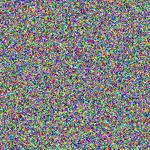
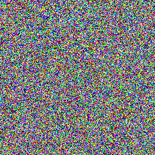
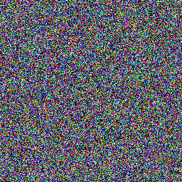
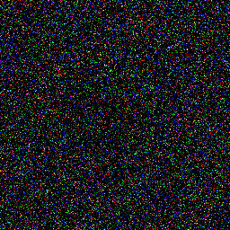
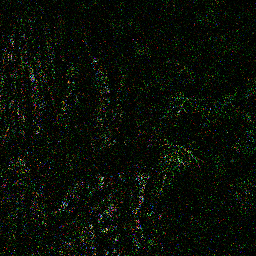
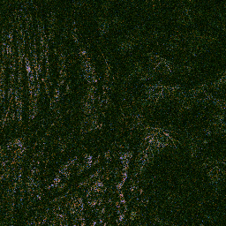
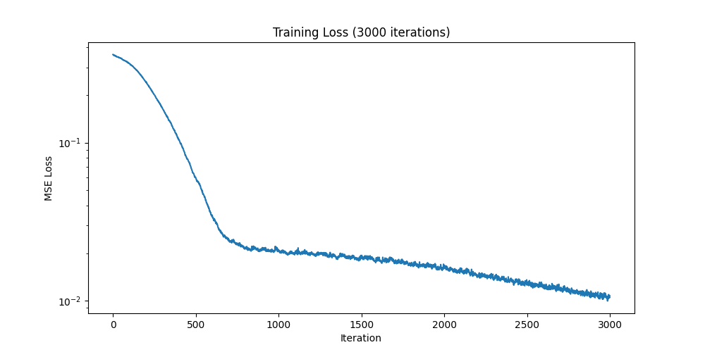
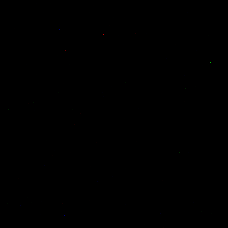
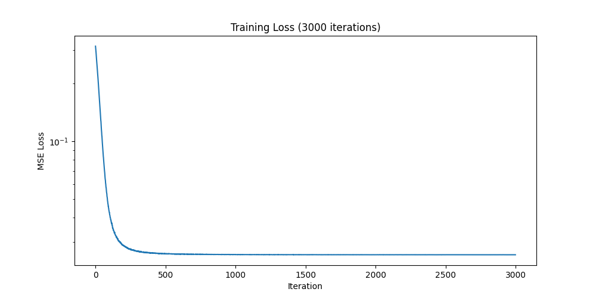

# CPPN

[](https://colab.research.google.com/github/NFAsylum/cppn/blob/main/notebooks/cppn_demo.ipynb)

Small PyTorch implementation of Compositional Pattern-Producing Networks (CPPNs). Supports two modes: random generation (procedural art from untrained weights) and single-image overfitting (CPPN as image compression demo).


## What is CPPN?

A **Compositional Pattern-Producing Network** is a neural network used as a *function from coordinates to values*. Instead of being trained on data, it takes a point `(x, y)` and outputs a color `(r, g, b)`. The full image is produced by querying every pixel independently.

These are the 3 ideas that make CPPNs more interesting:
- **No training.** Weights are initialized randomly. The network is never shown any image, the patterns emerge solely from the network's structure.
- **Symmetric activations.** Functions like `sin`, `cos`, `tanh` and Gaussians produce spatial regularities such as periodicity, symmetry and smooth gradients that pure ReLU networks cannot produce.
- **Resolution-independent.** Because the network maps coordinates rather than pixels, you can render the same pattern at any resolution. The `2048x2048` version is not an upscale of the `256x256`, both are sampled directly from the same function. Note: vanilla CPPNs exhibit spectral bias, quality degrades when sampling at resolutions higher than the training grid.

This implementation also adds a latent vector `z` that acts as a seed for pattern variations and an optional radial input `r` that biases the network toward radial compositions.

CPPNs were introduced by Kenneth Stanley in 2007 as a representation for evolutionary art and neural network topology generation.

## Gallery

| | | |
|:-------------------------:|:-------------------------:|:-------------------------:|
||  |  |
||  |   |
||||

## Training Mode

| | | |
|:-------------------------:|:-------------------------:|:-------------------------:|
||  |  |
||  |   |



## Image Compression

Training using recommended settings (default values) demonstrates compression (`19x` smaller than PNG target) at degraded but recognizable quality (`PSNR 19.68 dB`, still below JPEG quality).

| Metric | Value |
|---|---|
| Model (float32) | 100.3 KB |
| Target PNG | 1919.7 KB |
| Compression ratio | 19.15x |
| PSNR | 19.68 dB |
| Training duration | 133.1s |

## Limitations

This implementation uses Stanley's original 2007 architecture with `Normal(0, 1)` weight initialization. While effective for shallow networks (4-6 layers), this setup fails to train at greater depths.

I observed **dead network** behavior when configuring `hidden_dim=128` with `hidden_layers=8` in cppn.py:
- Training loss plateaus around iteration ~200 at a degenerate value
- Model output collapses to near-zero (near-black image with isolated colored pixels)
- PSNR drops to 15.91 dB (vs 19.68 dB at recommended `hidden_dim=64`, `hidden_layers=6`)





This is the **dead network problem**: signal saturation through deep `sin/tanh` layers causes vanishing gradients in the final sigmoid, preventing further learning. Modern INR architectures address this through specialized initialization (e.g., SIREN's bounded uniform init with ω₀=30) and Fourier feature encoding.

In short: vanilla CPPN scales cleanly up to ~6 layers. Going deeper requires architectural changes covered in recent INR literature.

## Quick Start

### Clone the repo

```bash
git clone https://github.com/NFAsylum/cppn.git
```

### Install dependencies

```bash
pip install -r requirements.txt
```

### Run generation

Random mode
```bash
cd cppn
python main.py
```

Training mode
```bash
cd cppn
python train.py
```

### Output

- Generated images in random mode are saved to `output/`.
- Training snapshots and logs are saved to `training_output/`.

## Available Settings

### Random mode

tileable: if image is tileable in all directions, default value is True.

sigma: affects how chaotic is the image, default value is random float between 0.3 and 3.

r_strength: affects how radial is the image, default value is random float between 0 and 10 (not used when tileable is active)

quantity: affects how many images are generated (all images will use the same model)

size presets (square images): 'xxxsmall':32, 'xxsmall':64, 'xsmall':128, 'small':256, 'medium':512, 'large':1024, 'huge':2048. Default preset is large

### Training mode

target_path: path for target image used in training

target_size: target image size used in training

render_size: image size for final rendering, (when bigger than target_size, exposes spectral bias)

iterations: amount of iterations for training

snapshot_iters: which iterations generate snapshot images

## References

- Stanley, K. O. (2007). *Compositional Pattern Producing Networks: A Novel Abstraction of Development*. Genetic Programming and Evolvable Machines, 8(2), 131–162. [DOI](https://doi.org/10.1007/s10710-007-9028-8)
- Ha, D. (2016). [*Generating Large Images from Latent Vectors*](https://blog.otoro.net/2016/04/01/generating-large-images-from-latent-vectors/). otoro.net — practical CPPN implementation reference.
- Sitzmann, V., Martel, J. N. P., Bergman, A. W., Lindell, D. B., & Wetzstein, G. (2020). *Implicit Neural Representations with Periodic Activation Functions*. NeurIPS 2020. [arXiv:2006.09661](https://arxiv.org/abs/2006.09661) — SIREN paper, addresses the depth/initialization limitations discussed above.
- Vaidyanathan, K. et al. (2023). *Random-Access Neural Compression of Material Textures*. SIGGRAPH 2023. [Project page](https://research.nvidia.com/labs/rtr/neural_texture_compression/) — NVIDIA Neural Texture Compression, applied INR for game-ready textures.

## License

MIT, see [LICENSE](./LICENSE).
