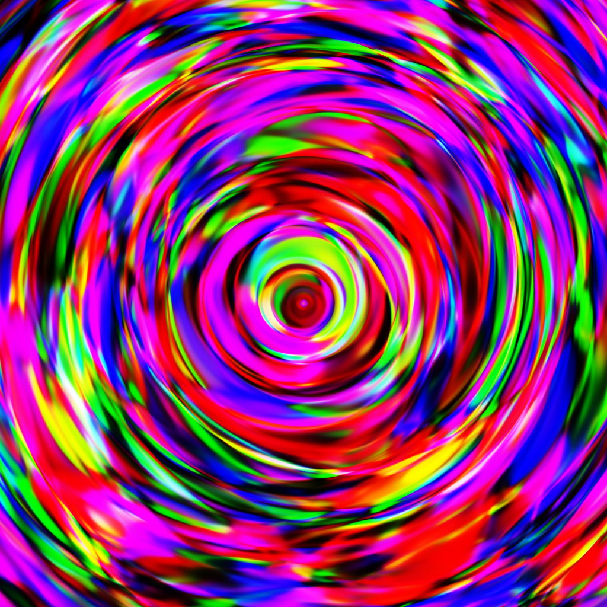
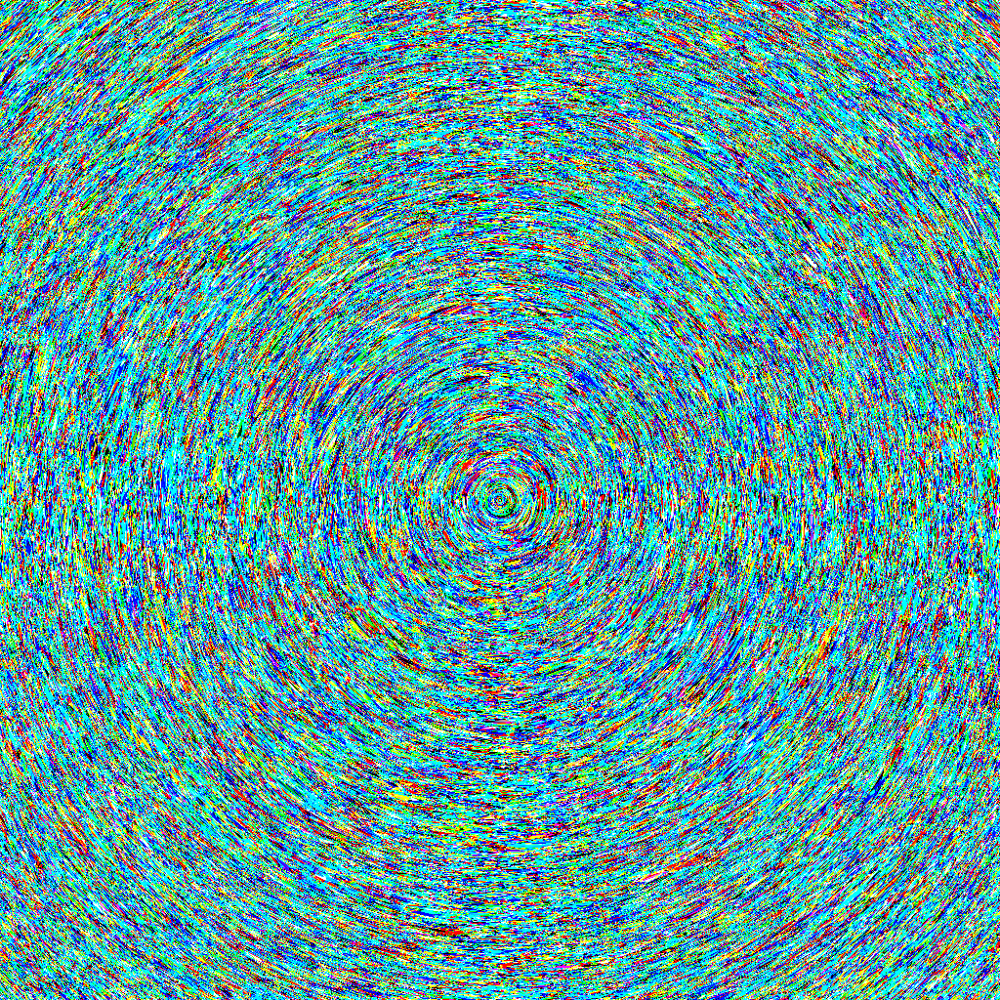
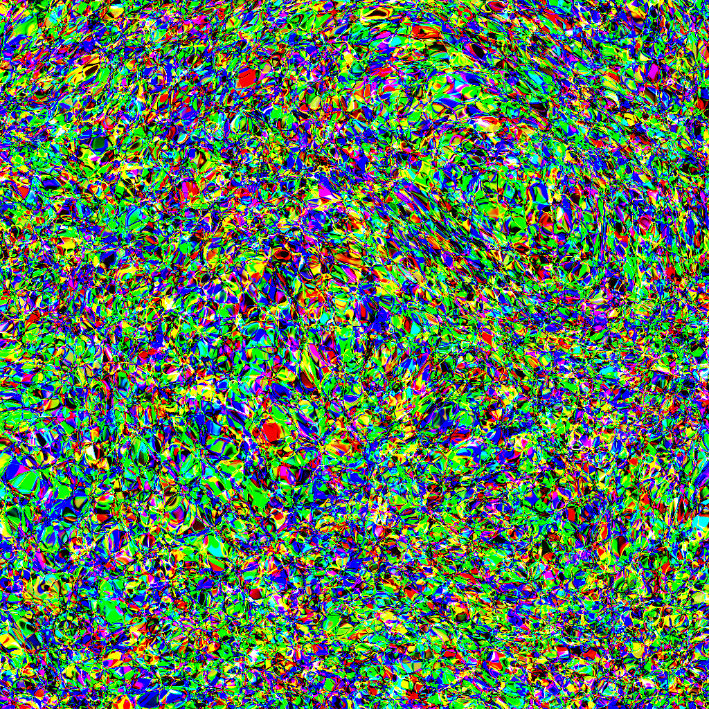
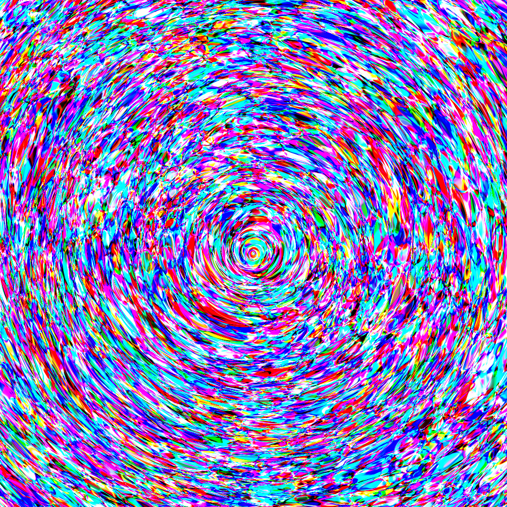
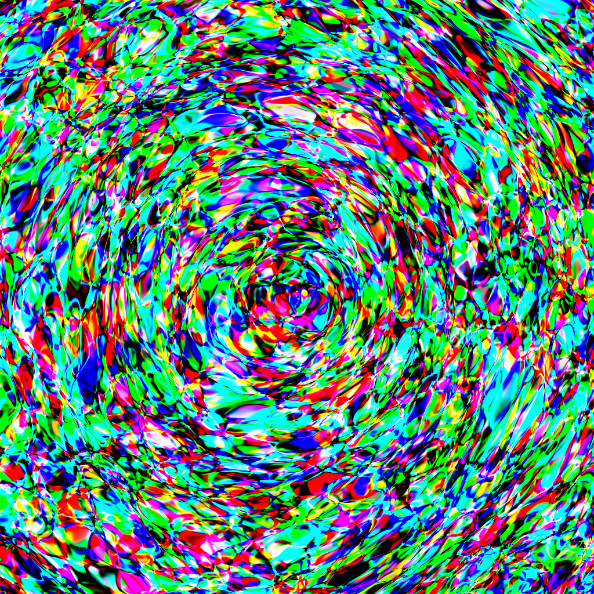
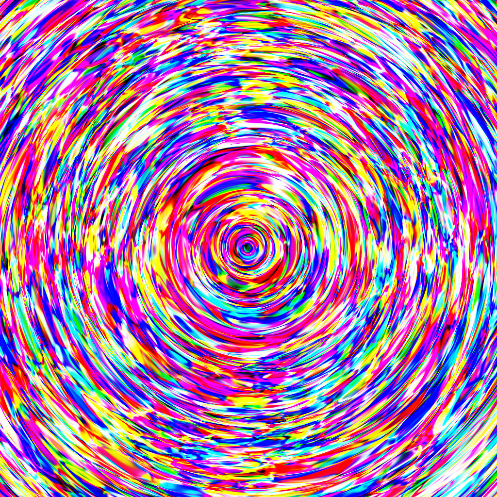
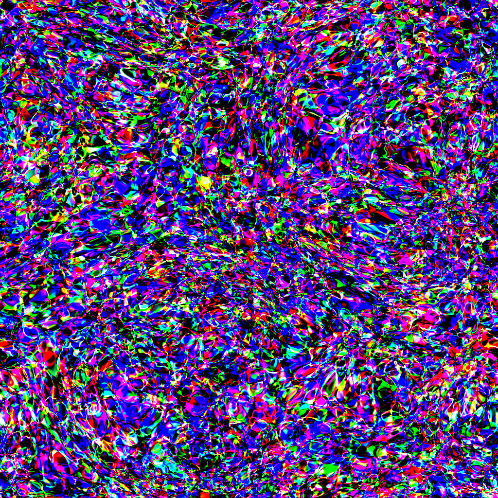
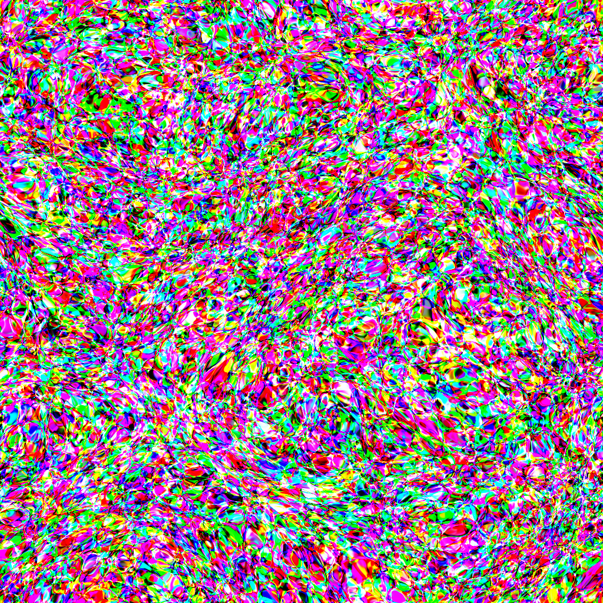
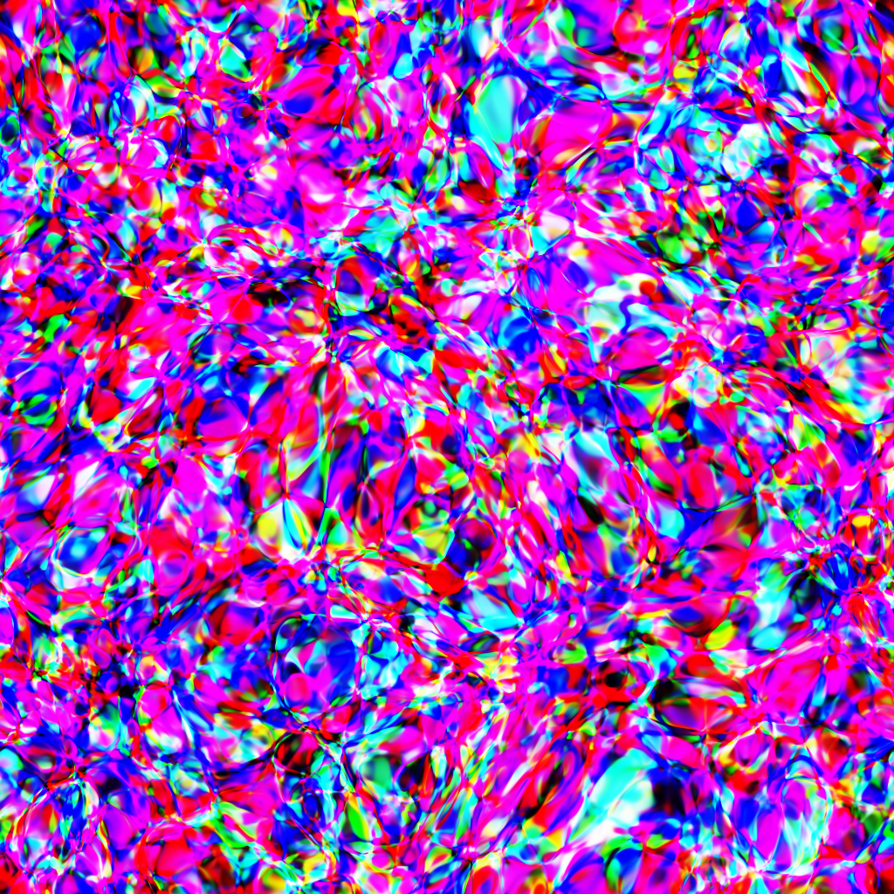

# CPPN

Compositional Pattern-Producing Network implementation using PyTorch



## What is CPPN?

A **Compositional Pattern-Producing Network** is a neural network used as a *function from coordinates to values*. Instead of being trained on data, it takes a point `(x, y)` and outputs a color `(r, g, b)`. The full image is produced by querying every pixel independently.

These are the 3 ideas that make CPPNs more interesting:
- **No training.** Weights are initialized randomly. The network is never shown any image, the patterns emerge solely from the network's structure.
- **Symmetric activations.** Functions like `sin`, `cos`, `tanh` and Gaussians produce spatial regularities such as periodicity, symmetry and smooth gradients that pure ReLU networks cannot produce.
- **Resolution-independent.** Because the network maps coordinates rather than pixels, you can render the same pattern at any resolution. The `2048x2048` version is not an upscale of the `256x256`, both are sampled directly from the same function.

This implementation also adds a latent vector `z` that acts as a seed for pattern variations and an optional radial input `r` that biases the network toward radial compositions.

CPPNs were introduced by Kenneth Stanley in 2007 as a representation for evolutionary art and neural network topology generation.

## Quick Start

### Clone the repo

```bash
git clone https://github.com/NFAsylum/cppn.git
```

### Install dependencies

```bash
pip install -r requirements.txt
```

### Run generation

```bash
cd cppn
python main.py
```

### Output

Generated images are saved to `output/`.

## Available Settings

tileable: if image is tileable in all directions, default value is True.

sigma: affects how chaotic is the image, default value is random float between 0.3 and 3.

r_strength: affects how radial is the image, default value is random float between 0 and 10 (not used when tileable is active)

quantity: affects how many images are generated (all images will use the same model)

size presets (square images): 'xxxsmall':32, 'xxsmall':64, 'xsmall':128, 'small':256, 'medium':512, 'large':1024, 'huge':2048. Default preset is large

## References

- Stanley, K. O. (2007). *Compositional Pattern Producing Networks: A Novel Abstraction of Development*. Genetic Programming and Evolvable Machines, 8(2), 131–162. [DOI](https://doi.org/10.1007/s10710-007-9028-8)
- Ha, D. (2016). [*Generating Large Images from Latent Vectors*](https://blog.otoro.net/2016/04/01/generating-large-images-from-latent-vectors/). otoro.net — practical CPPN implementation reference.

## Gallery

| | | |
|:-------------------------:|:-------------------------:|:-------------------------:|
||  |  |
||  |   |
||||